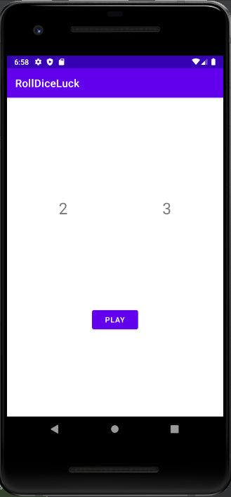

# RollDiceLuck

Roll Dice Luck

1 - Tem como objetivo descobrir quem é a pessoa mais sortuda atraves de valores randomicos.   
2 - O desenvolvendo um app que gera 2 valores de 1 a 6 de forna randômica.   
3 -     
      3.1 Criar uma tela que gera valores randomicamente e um botão para parar os valores;   
      3.2 Desenvolve a parte gráfica;   
      3.3 Cria uma tela inicial que introduz o app;   
      3.4 Cria uma solução para enviar os dados do jogador para outra tela;   
      3.5 Implementação extra - Salvar esses dados de acordo com o jogador(criar um histórico).  

 <h2>Etapa - 1 </h2>

