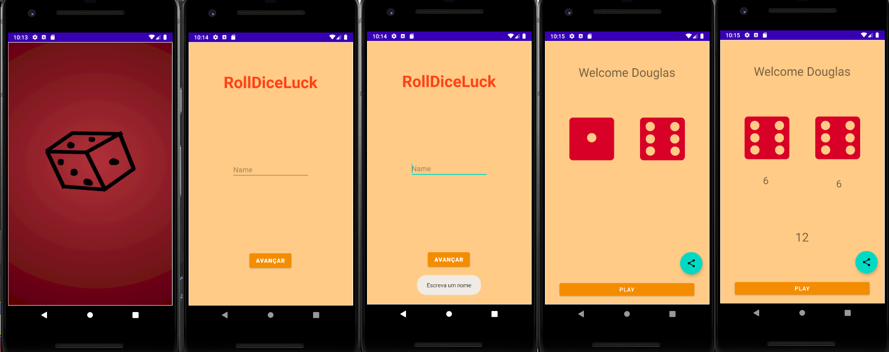

# RollDiceLuck

Roll Dice Luck

1 - O aplicativo tem como objetivo descobrir quem é a pessoa mais sortuda através de valores randômicos do dado.   
2 - O funcionalidade da app é mostrar 2 valores entre 1 e 6 de forma randômica e retorna a soma dos valores.   
3 -     
      3.1 A primeira tela tem um Splash Screen   
      3.2 A segunda solicita o nome do jogador, mas caso não coloque o nome, o app impede a mudança de tela ate que tenha o nome escrito;   
      3.3 A terceira e última tela mostra a interface e a funcionalidade que é mostrar dois números randômicos e mostrar na tela a soma dos dados.   

